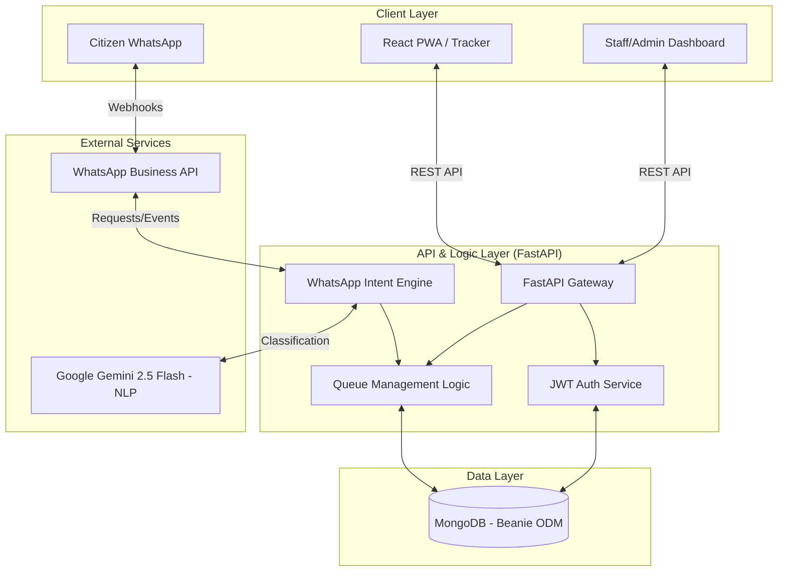
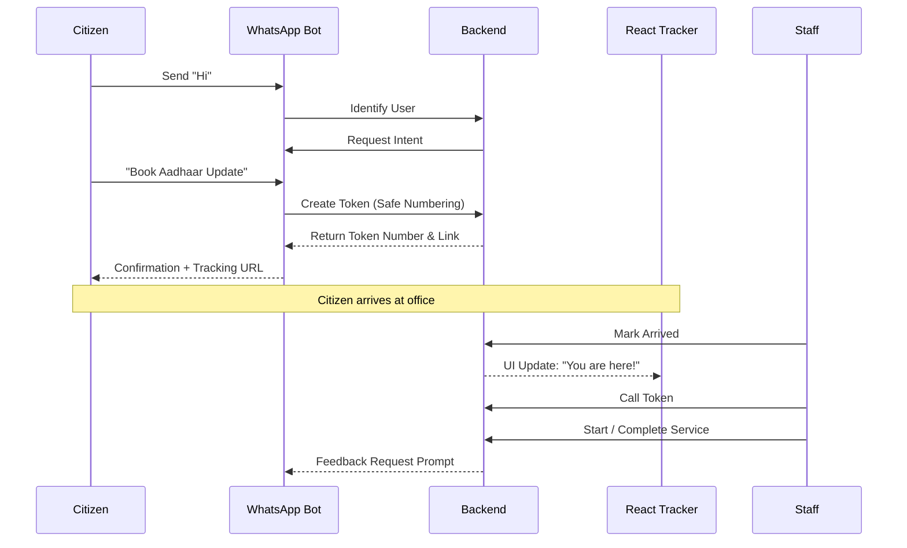
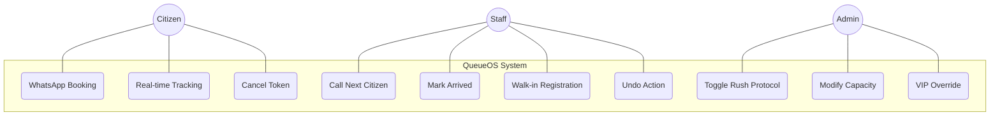
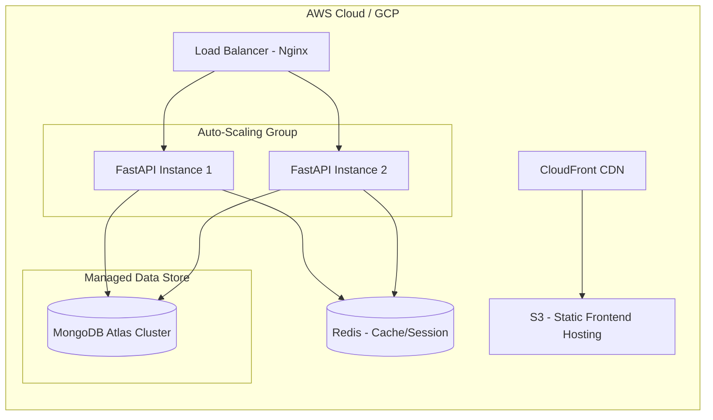

# QueueOS: System Architecture & Visual Design

This document contains the visual and structural blueprints for the QueueOS platform, utilizing Mermaid.js for flowcharts and Markdown-based wireframe specifications.

---

## 1. Detailed Flow Architecture Diagram


---

## 2. Process Flow Diagram: Citizen Journey


---

## 3. Use-Case Diagram


---

## 4. Architecture Diagram (Cloud Infrastructure)


---

## 5. Wireframes / Mock Diagrams

### Screen 1: Citizen Tracker (PWA)
| Component | Type | Functionality |
| :--- | :--- | :--- |
| **Top Bar** | Header | Displays Branch Name and "Live Status" badge. |
| **Token Number** | Large Text | Huge display of `A-105` for physical counter matching. |
| **Status Chip** | Badge | Dynamic colors: Blue (Waiting), Green (Called), Orange (Late). |
| **Progress Bar** | Visual | Shows % of queue cleared before this token. |
| **ETA Display** | Metric | "Estimated Wait: 15 Minutes" |
| **Hold Spot** | Button | Triggers "Delay/Running Late" logic (+15 mins). |
| **Feedback** | Rating | 5-star rating (Visible only after Completion). |

### Screen 2: Staff Operational Command
```text
+-------------------------------------------------------------+
| [ Branch: Mumbai Central ] [ Desk: 04 ]      [ LOGOUT ]     |
+-------------------------------------------------------------+
|  [ SEARCH TOKEN... ]          [ WALK-IN + ]   [ CALL NEXT ] |
+-------------------------------------------------------------+
|  CURRENTLY SERVING            |  WAITING QUEUE (12)         |
|  +-------------------------+  |  +-----------------------+  |
|  | Token: A-101            |  |  | Token: A-102          |  |
|  | User: John Doe          |  |  | [ CALL ] [ TRANSFER ] |  |
|  | [ START ] [ COMPLETE ]  |  |  +-----------------------+  |
|  | [ NO-SHOW ]             |  |  | Token: A-103          |  |
|  +-------------------------+  |  | [ CALL ] [ TRANSFER ] |  |
+-------------------------------------------------------------+
|  [ UNDO LAST ACTION (4:20s left) ]                          |
+-------------------------------------------------------------+
```

### Screen 3: Admin Overdrive Panel
| Section | Component | Purpose |
| :--- | :--- | :--- |
| **KPI Strip** | 4 Cards | Tokens Today, Avg. Wait, No-Show %, Active Desks. |
| **Rush Mode** | Toggle Switch | Triggers block on walk-ins and broadcasts warnings. |
| **Capacity** | Input/Slider | Sets `active_desks` (1-10) for the branch. |
| **VIP Override**| Action Button | Injects a Priority-1 token immediately. |
| **Reset Queue** | Danger Button | Emergency clear of all active branch data. |
| **Analytics** | Line Graph | Hourly traffic vs. Service time efficiency. |
