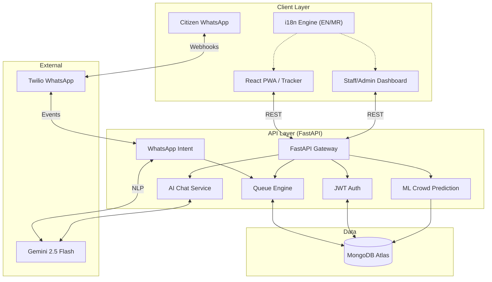
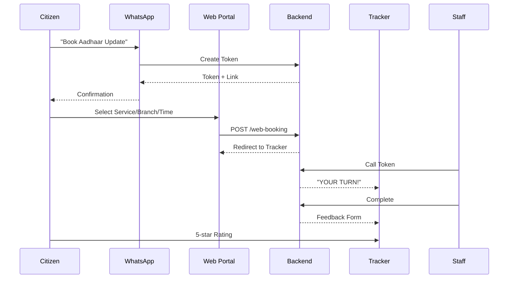
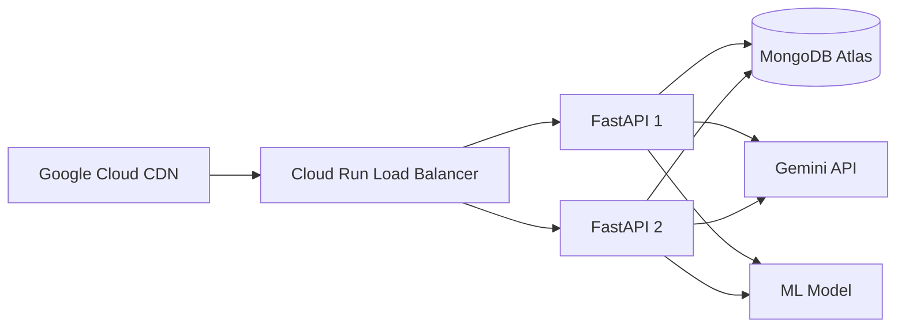

# QueueOS: System Architecture & Visual Design

Mermaid.js diagrams and wireframe specifications for QueueOS.

---

## 1. Flow Architecture Diagram



---

## 2. Citizen Journey Sequence



---

## 3. Use-Case Diagram

```mermaid
graph TD
    Citizen((Citizen))
    Staff((Staff))
    Admin((Admin))
    subgraph "QueueOS"
        UC1["WhatsApp Booking"]
        UC2["Web Booking"]
        UC3["Live Tracking"]
        UC4["Delay Report"]
        UC5["Feedback"]
        UC6["Language Toggle"]
        UC7["AI Doc Chat"]
        UC8["Cancel/Reschedule"]
        UC9["Call Next"]
        UC10["Walk-in"]
        UC11["Arrived"]
        UC12["Undo"]
        UC13["Transfer"]
        UC14["Grace Re-entry"]
        UC15["Rush Protocol"]
        UC16["Capacity"]
        UC17["VIP Override"]
        UC18["Reset"]
        UC19["Analytics"]
    end
    Citizen --- UC1 & UC2 & UC3 & UC4 & UC5 & UC6 & UC7 & UC8
    Staff --- UC9 & UC10 & UC11 & UC12 & UC13 & UC14 & UC6
    Admin --- UC15 & UC16 & UC17 & UC18 & UC19 & UC6
```



---

## 4. Cloud Architecture



---

## 5. Data Model

```mermaid
erDiagram
    USER ||--o{ TOKEN : has
    BRANCH ||--o{ TOKEN : serves
    SERVICE ||--o{ TOKEN : for
    USER { string phone PK; string name; string role }
    BRANCH { string name; int active_desks; bool rush_mode }
    SERVICE { string name; int duration; list docs }
    TOKEN { string number; string status; string booking_type; int rating }
```

---

## 6. Wireframes

### Landing Page

| Component   | Functionality                            |
| ----------- | ---------------------------------------- |
| Header      | Brand, Language Toggle (EN/MR), Sign In  |
| Hero        | Token search, "Track Live" CTA           |
| Stats       | Avg Wait Saved, Live Updates, WhatsApp   |
| Cards       | Book Appointment, Dashboard, Staff Portal|

### Citizen Tracker (Mobile-First)

| Component     | Functionality                 |
| ------------- | ----------------------------- |
| Token Display | Giant number (3-5rem)         |
| Status Chip   | Dynamic color by state        |
| Progress Bar  | Queue % cleared               |
| Queue Stats   | Est. Wait + Now Serving       |
| Actions       | Hold Spot, Rate Experience    |

### Staff Dashboard

| Component      | Functionality                             |
| -------------- | ----------------------------------------- |
| Control Bar    | Branch, Desk, Rush, Walk-In, Call Next    |
| Serving Column | Start/Complete/No-Show per citizen        |
| Waiting Grid   | Card grid with Call/Transfer actions      |

### Admin Overdrive

| Component    | Functionality                    |
| ------------ | -------------------------------- |
| KPI Cards    | Served, Waiting, Efficiency, No-Show |
| Emergency    | Rush, VIP Override, Reset        |
| Settings     | Desk capacity modification       |
| Live Preview | Embedded Staff Dashboard         |
